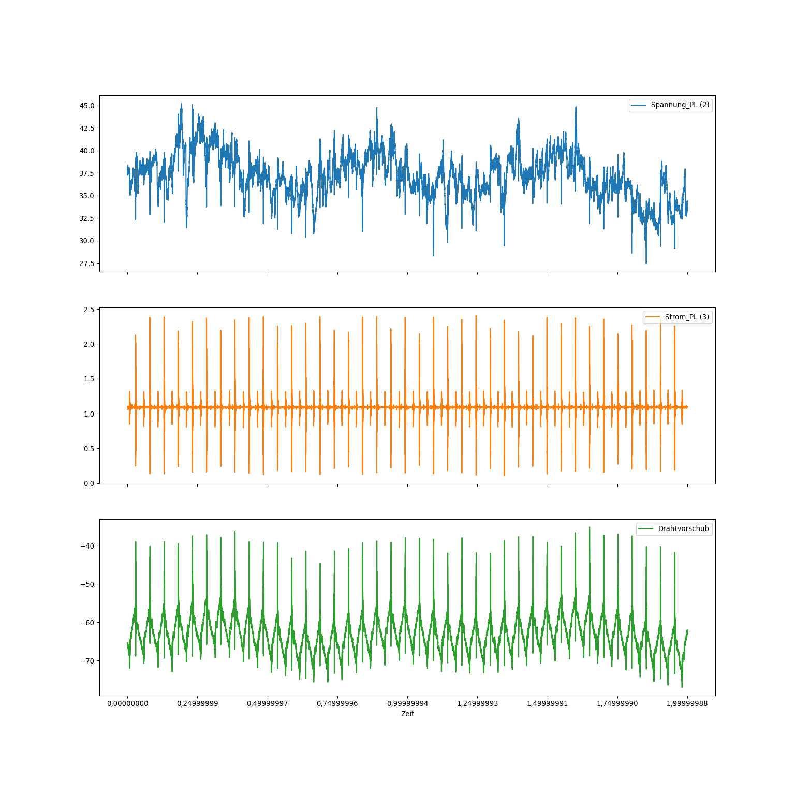
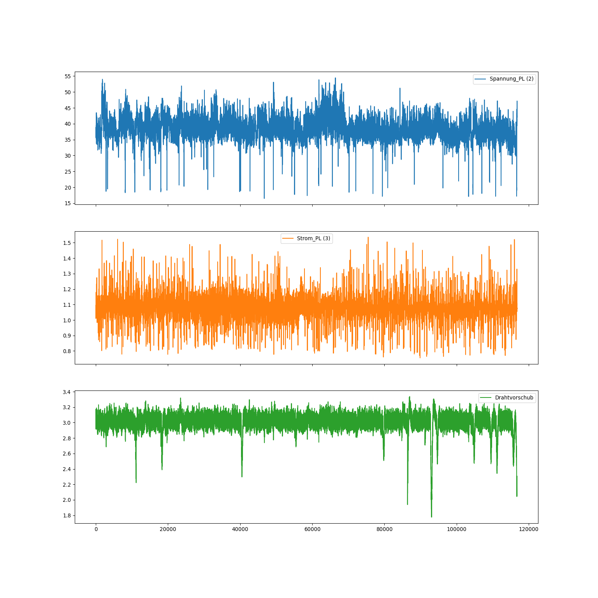
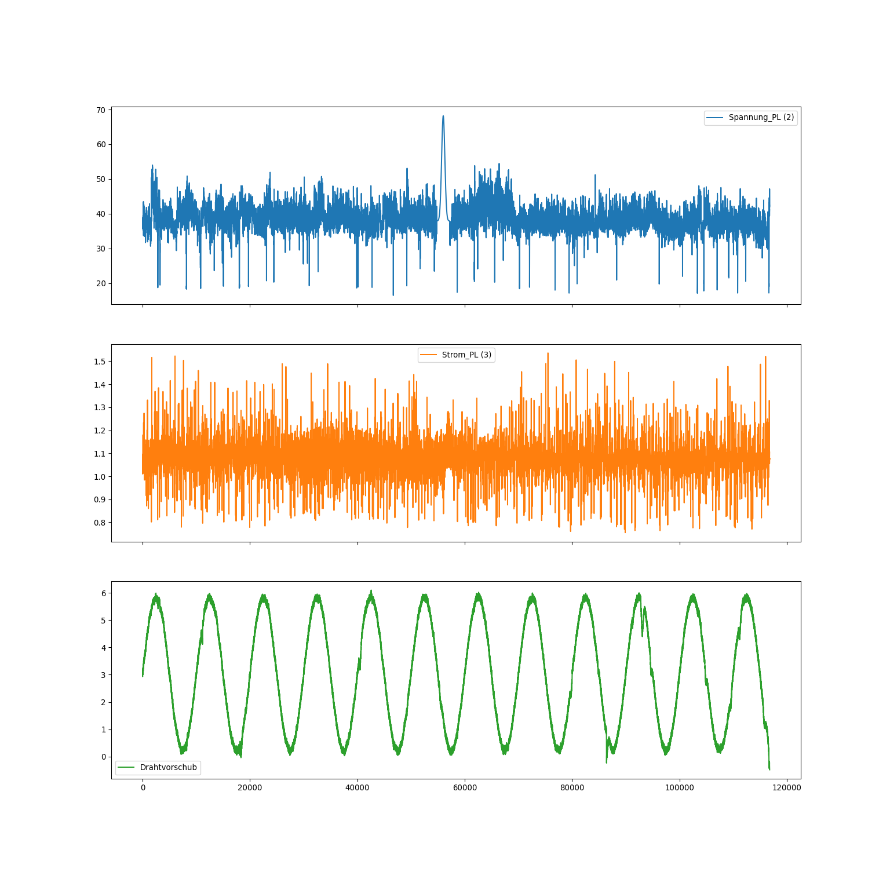
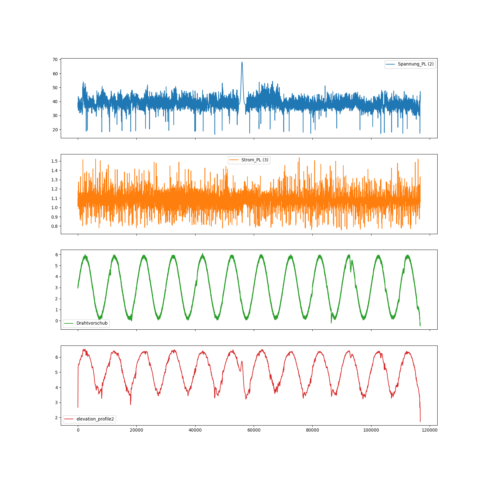

# DataGen

Datagenerator for Masterthesis in the Project "Präzision-LDS"

The purpose of this Datagenerator is to create a timeseries based on some seeddata csv files. The seeddata can be further transformed and new features that are based on the seed data timeseries can be added. 

## Instructions for using

Install the necessary requirements with 

> pip install requirements

The configurations for the timeseries can be set in the config.yaml. One example for a config file can be found in configExample.yaml. You can copy it into the config.yaml. 

The seeddata should be stored in subfolders of data. The depth should be the following:
data
* 1stsubfolder  
    * 1stfile.csv
    * ...
* ...
 

Run the datagenerator with:

> python -m dataGen

Find the output timeseries in output_data.  Either only the extendend timeseries in extended_series or with the added feature in new_feature or new_feature_subsampled.

## Features

Find a list of the features below. All parameters for the configurations can be set in the config file. The parameters are explained in the comments of config.

Features:
* Create timeseries with timeseries seeddata from csv's
* Transform seed data through:
    * concatenating
    * smoothing, noising
    * scaling
    * ...
    * Injections: 
        * Anomalies
        * Pattern
* Create additional feature that is related with seeddata features through Gaussian distribution

The new feature is based in a linear relation on the seeddata. In the last part ('generate') of the config, in the substance_vals, the factors can be set.
The sum of the substance vals get spreaded in the new feature through a normal distribution, like a cone that sprays some material. 

In the following figures one can see the steps that a seeddata file runs through. In the first  we can see one example csv file with three different sensor timeseries. 

In the next figure one can see the result of a variety of seeddatafiles concatenated and subsampled.

The next figures shows the seeddata where an anomaly and a sine wave have been injected in the timeseries.
 
In the last figure the corresponding new feature has been added.

## Documentation

A more explicit explanation of DataGen can be found [here](doc/index.md).

