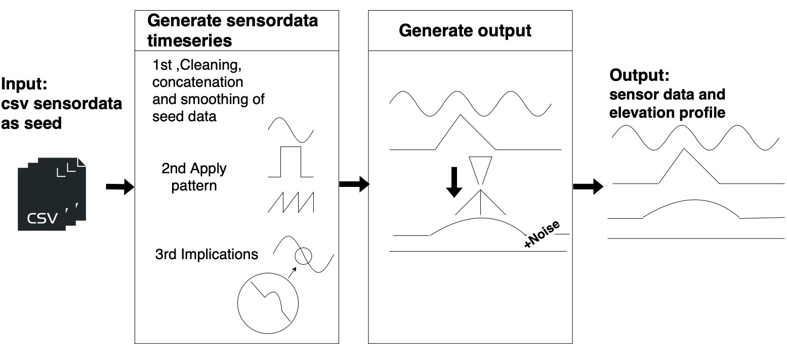
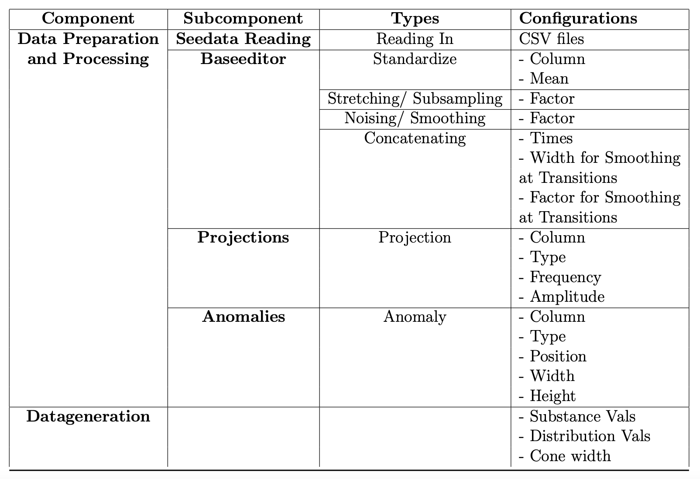

## Documentation DataGen

The input of the datagenerator are CSV files, that contain real world seed data. The data generator can be separated into two components. Its structure is described in Figure \ref{fig:Structure_data generator}. In the first component - the "Data Preparation and Processing", the data gets processed and extended. In the second component, the Outputfeature Generation", the output is calculated and added as an output feature to the other input features. It is determined by a function influenced by the input parameters. Similarly any other feature that depends on the input parameters, could be generated, like the roughness of the surface. The output of the datagenerator is a csv file of a timeseries with the transformed data and the new feature.

Components:
* Datapreparation and Processing
    * seeddatareader
    * baseeditor
    * pattern generator
* DataGeneration
    * elevation profile generator

__main__ is the initial entry point. 

In the line
>if __name__ == "__main__":

the config is read and the functions are being called. First the reading of the seeddata (from seeddatareader), then the transformation of the timeseries (baseeditor and pattern generator). And lastly the generation of the new feature(elevation profile generator). 

## Components Datagenerator

An overview of the components can be seen in the following figure:

### Data Preparation and Processing
For the data to have the right length and variety, it undergoes several extension and processing steps. 
The data generator reads the dataset configurations from a designated configuration file. This has allowed us to experiment with diverse dataset characteristics to determine the characteristics the data need for the machine learning algorithms. For the Data Preparation and Processing we have three components, the ``\emph{Seeddata Reading}", the ''\emph{Base Editing} and the ’’\emph{Pattern Generation}. The pseudocode in Algorithms \ref{alg:seeddatareader} - \ref{alg:Pattern Generation} shows the logic of the three components.

#### Seeddata Reading
The seeddata reader serves as the initial point of entry, fetching the data and creating a dataframe. This dataframe forms the basis for subsequent processing steps. In the follwoing we describe which steps are being taken to provide this dataframe.
* Reading In
    * Initially, the data is sourced from a list of all csv files. All files that are listed in the config file are incorporated
    * For this scenario we have also added some features to the data files. Through the given information about the experiment set up, we know the target values of the two factors speed of the robot and quantity of the atomizing gas. But because they were only static for these experiments, we could not get any additional information out of them. So we considered them to be constant. If more sensors will be added for the future, one could add these features also for the input.
           
* Cleaning
    * The data then gets cleaned. The cleaning process removes some columns that only contain Nan-values.
          
* Concatenating Data files
    * If multiple data files are listed they get concatenated. This is one way we can create one long timeseries out of the many different short timeseries from the TS-PL experiments. 
    * A smoothing algorithm is applied, that smoothes the values that lie around the concatenationpoint. 
            
#### Base Editing
The base editor further processes the dataframe to get it in the required shape. This includes stretching, concatenating and adding noise or smooth. The resulting dataframe can be seen as the base, before the incorporation of patterns and anomalies change the datastructure and the values of the sensors.
          
* Stretch\ Subsample
    * The data generator accepts a stretch factor that elongates or subsamples the data. This is needed because the data in the experiment was measured in a very high frequency. This results in a high volume of data that requires lots of computational power to process. Also the windowsize that need to be given to the machine learning algorithm would have needed to be very large. Because the effect of a cone would be found on a very wide window.  
    * With the subsampling parameter, you could either make the data shorter or longer. This would lead to throwing out rows of data or the insertion of rows with an interpolation of the values.

            
* Concat
    * The resulting dataframe can be further concatenated to get a length of the timeseries, that would equal a sufficient amount of time to simulate the TWAS process.

* Noise/Smooth
    * The data features can either be smoothened or injected with Gaussian noise. This could for instance be applied to counteract on some effects that come with stretching or subsampling. If the data gets stretched or subsampled this can automatically smooth the data or make it look more noisy. To reduce the effect, one could apply a smoothing or some noise, depending on the processing before. 
* Standardize
    * Some sensor were found to have calibration discrepancies. So the numbers do not match with the constants given with the documented experiment set up. For those values we scaled the values to vary between a min and max value  and shifted them to the desired mean. In our use case the mean was set to 3 because this was indicated as the constant wire feed in the experiment design and values.
           
#### Pattern Generation
Until this point the data has been processed to a form on which we then want to apply the patterns to bring in some variety into the data and make it more dynamic.
* Projection
    * In the projection component, patterns can be added to the values of the input features. This could for instance simulate some of the features, that are static at the moment to become dynamic. One can choose between an applied sine wave or a random walk. A random walk is a pattern where for each step, a random value chosen of (1,0,-1) gets chosen and gets summed up with the value in the step before.
  These patterns get applied on the whole series of an input feature.
* Anomalies
    * Anomalies, replicating unexpected events like sudden voltage surges, can be infused at specified data points. These anomalies are either shaped as a normal distribution or a square, offering insights into potential process disruptions.
         
       
            

