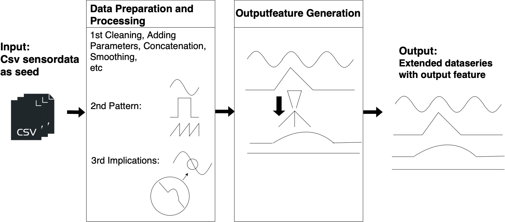

The input of the datagenerator are CSV files, that contain real world seed data. The data generator can be separated into two components. Its structure is described in Figure \ref{fig:Structure_data generator}. In the first component - the "Data Preparation and Processing", the data gets processed and extended. In the second component, the Outputfeature Generation", the output is calculated and added as an output feature to the other input features. It is determined by a function influenced by the input parameters. Similarly any other feature that depends on the input parameters, could be generated, like the roughness of the surface. The output of the datagenerator is a csv file of a timeseries with the transformed data and the new feature.

Components:
* seeddatareader
* baseeditor
* pattern generator

* elevation profile generator

__main__ is the initial entry point. 

In the line
>if __name__ == "__main__":

the config is read and the functions are being called. First the reading of the seeddata, then the transformation of the timeseries. And lastly the generation of the new feature.
